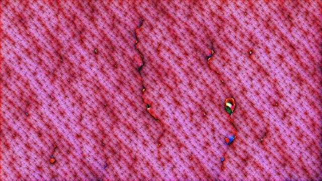
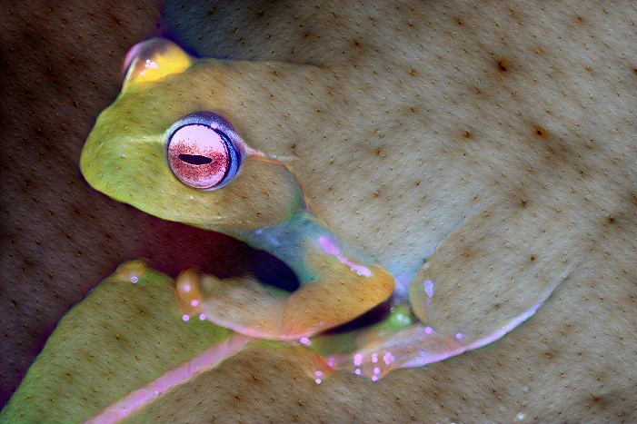

# Phrok
This is a extension of [Erik Linder-Noréns minimal Deep Dream example](https://github.com/eriklindernoren/PyTorch-Deep-Dream/) which adds support for a COCO trained Resnet50, selection of individual neurons and offsets.
All images in [out_ref](https://github.com/frdnd/phrok/tree/master/out_ref) were rendered in 2560x1440 and downscaled by factor `0.25`, rendering one image takes about 15s on a RTX2070super.

## Installation
`pip3 install -r requirements.txt`

## Render an example
display all options with `python3 dream.py -h`

```usage: dream.py [-h] [--iterations ITERATIONS] [--layer LAYER]
                [--bottleneck BOTTLENECK] [--lr LR]
                [--octave_scale OCTAVE_SCALE] [--octaves OCTAVES]
                [--neuron NEURON] [--offset OFFSET] [--img_width IMG_WIDTH]
                [--img_height IMG_HEIGHT]
                [--img_initialization {black,input_img}]
                [--input_image INPUT_IMAGE]
                [--modeltype {resnet50_coco,resnet50_keypoint,resnet50_imagenet,vgg19_imagenet}]
                [--out_path OUT_PATH] [--from_example FROM_EXAMPLE]

optional arguments:
  -h, --help            show this help message and exit
  --iterations ITERATIONS
                        number of gradient ascent steps per octave
  --layer LAYER         layer used
  --bottleneck BOTTLENECK
                        bottleneck only applicable to resnet50 models
  --lr LR               learning rate, the higher the more detail
  --octave_scale OCTAVE_SCALE
                        image scale between octaves
  --octaves OCTAVES     number of octaves, the higher the more recursion
  --neuron NEURON       neuron/channel at which the loss is computed, -1
                        evaluates all neurons/channels
  --offset OFFSET       neuron/channel at which the loss is computed, -1
                        evaluates all neurons/channels
  --img_width IMG_WIDTH
                        image width, if img_initialization is not input_img.
                        maximum size depends on gpu memory.
  --img_height IMG_HEIGHT
                        image height, if img_initialization is not input_img
                        maximum size depends on gpu memory.
  --img_initialization {black,input_img}
                        initialization of the image, if no input image is
                        provided
  --input_image INPUT_IMAGE
                        path to input image
  --modeltype {resnet50_coco,resnet50_keypoint,resnet50_imagenet,vgg19_imagenet}
                        network to use for dreaming
  --out_path OUT_PATH   output directory
  --from_example FROM_EXAMPLE
                        load a config from the examples
```

render the [cactus example](https://github.com/frdnd/phrok/blob/master/out_ref/cactus.jpg)

`python3 dream.py --from_example example_configs/cactus.yaml`

or equivalent

`python3 dream.py  --img_initialization "black" --iterations 30 --lr 0.1 --modeltype resnet50_coco --neuron 478 --octave_scale 1.4 --octaves 20 --offset 0.0001 --layer 6 --bottleneck 0`

which gives:

<p align="center">
    
</p>

if you want to apply this to a input real input image use `python3 dream.py --img_initialization input_img --input_image imgs/frog.jpg --lr 0.01`

<p align="center">
    
</p>

## Parameter ranges
VGG19 can be expressed as a pure sequential model, due to this the only parameter needed is `layers` and `neurons`.

The number os neurons/channels for each layer in VGG19 are:

| layer | neurons |
| :-----: | :-----: |
| [0..4] | 64 |
| [5..10] | 128 |
| [11..19] | 256 |
| [20..36] | 512 |

Resnet50 starts with 4 conventional layers (Conv/BN/Relu/Maxpool), the following layers are modules built from bottleneck layers,
 therefore the additional bottle `bottleneck` argument is used (addressing the single layers in a bottleneck layer didn't yield better results). 

The number of neurons/channels for each layer and bottleneck in Resnet50 are:

| layer | bottleneck | neurons |
| :--------: | :------------:| :-----: |
| 4 | [0..2] | 256 |
| 5 | [0..3] | 512 |
| 6 | [0..5] | 1024 |
| 7 | [0..2] | 2048 |
